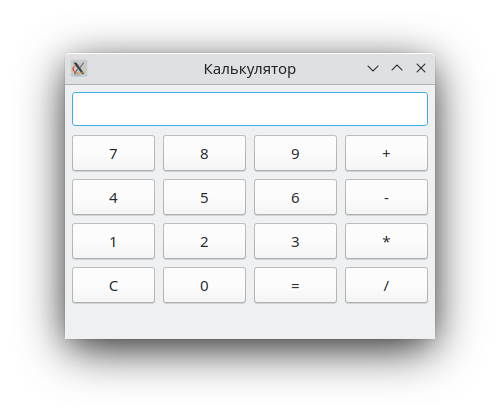
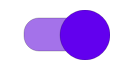
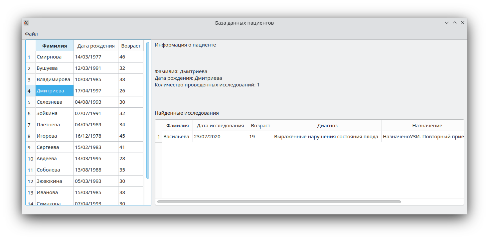
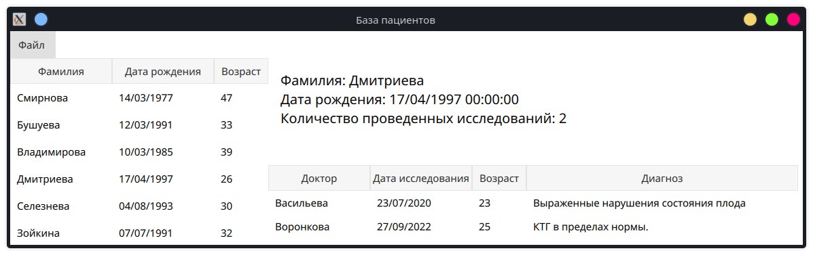
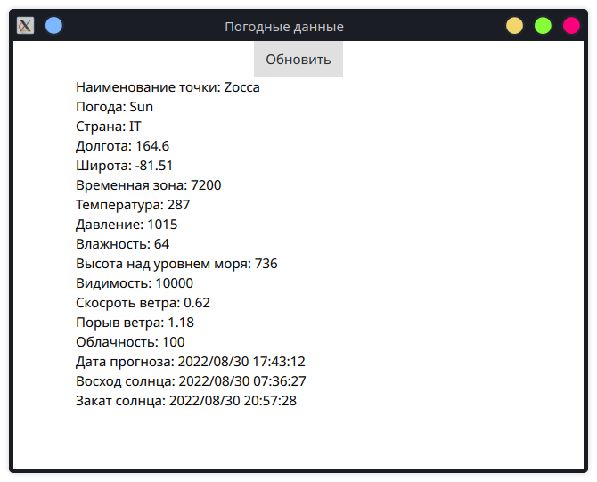
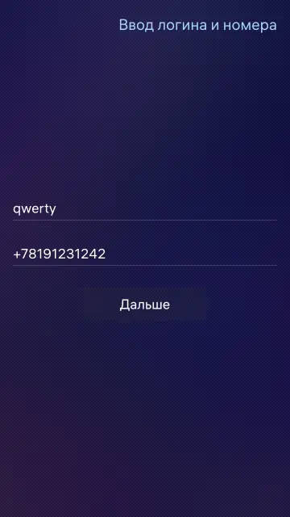
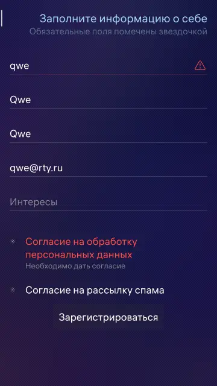
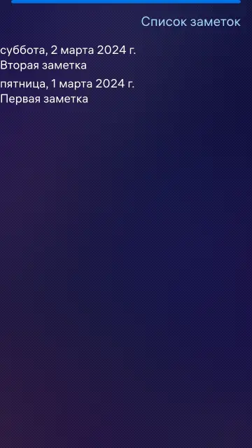
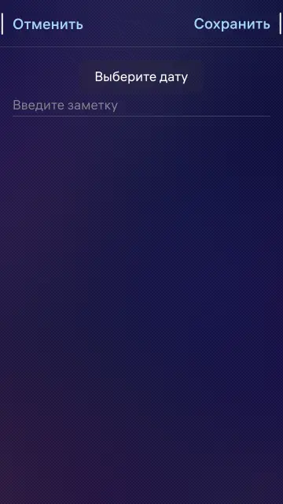
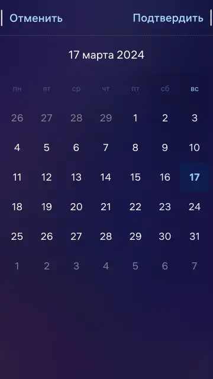

# QtSandbox

Домашние задания:
* [Калькулятор](#Калькулятор)
* [Виджет](#Виджет)
* [База данных с пациентами](#База-данных-с-пациентами)
* [База данных с пациентами на QML](#База-данных-с-пациентами-на-QML)
* [Работа с сетью](#Работа-с-сетью)
* [Регистрация](#Регистрация)
* [Заметки](#Заметки)

# Калькулятор

Простейший калькулятор на сигналах с поддержкой клавиатуры

  

# Виджет
Самописный виджет свича по материал дизайну

  

# База данных с пациентами
Работа с базой данных sqlite. Кастомные делегаты.

  

# База данных с пациентами на QML
Работа с базой данных sqlite. Кастомные делегаты. QMl.

  

# Работа с сетью
Получение погодных данных.

  

# Регистрация
Приложение, сумулирующее регистрацию пользователя.

    
    

# Заметки
Добавление, удаление, изменение заметок

    
    
    

