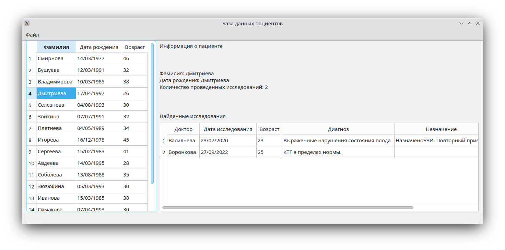

# QtSandbox

Домашние задания:
* [Калькулятор](#Калькулятор)
* [Виджет](#Виджет)
* [База данных с пациентами](#База-данных-с-пациентами)
* [Работа с сетью](#Работа-с-сетью)

# Калькулятор

Простейший калькулятор на сигналах с поддержкой клавиатуры

  

# Виджет
Самописный виджет свича по материал дизайну

  

# База данных с пациентами
Работа с базой данных sqlite. Кастомные делегаты.

  

# База данных с пациентами на QML
Работа с базой данных sqlite. Кастомные делегаты. QMl.

  

# Работа с сетью
Получение погодных данных.

  

