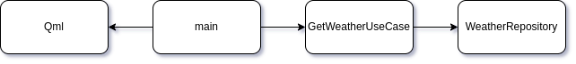

# Пример работы с сетью

## Архитектура:

  

## Краткое описание:
1. Содержимое main.cpp выполняет связывание представления с источником данных и создание зависимостей.
2. Сценарий выполнения запроса происходит в GetWeatherUseCase. Там же меняется поток выполнения.
3. Запрос выполняется синхронно в WeatherRepository
4. В WeatherRepository также происходит парсинг json модели через WeatherDataParser.
5. Модель для отрисовки WeatherModel принимает в себя результат выполнения GetWeatherUseCase в виде продктовой модели WeatherData.